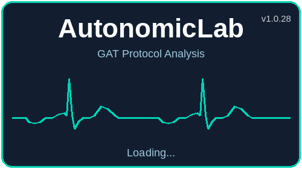
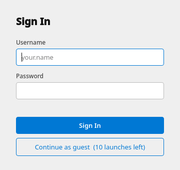
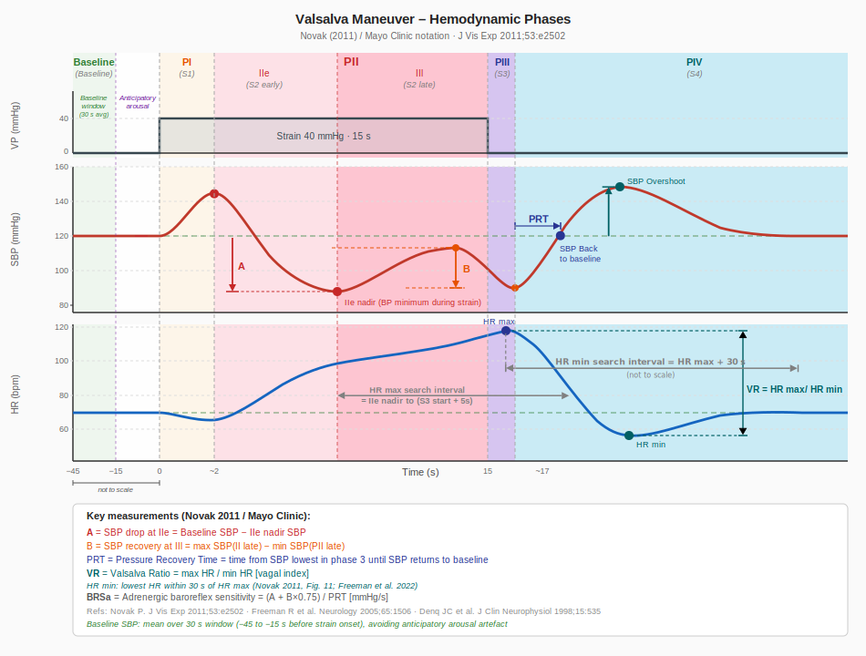

# AutonomicLab — User Guide

## Starting the program

Double-click `AutonomicLab.exe` on your desktop.

**Windows SmartScreen warning:** The first time you run the installer or the program,
Windows may display a blue warning screen saying *"Windows protected your PC"*.
This is expected for software without a commercial code-signing certificate.

Click **More info**, then **Run anyway** to proceed.

A splash screen appears while the program loads, followed by the login dialog.



---

## Logging in

When the program starts, a login dialog is shown.



- Enter your **Username** and **Password** and click **Sign In**.
- If you do not have an account, click **Continue as guest** to launch as a guest.
  Guest access is limited to a fixed number of launches per machine.
  Contact your administrator to create a personal account.

If no user accounts have been created yet (first run), the login dialog is skipped
and you go directly to the main window.

---

## Loading a dataset

Click **Open Dataset** in the left panel. A small dialog asks what you want to open.

### CSV dataset (folder)

1. Click **CSV Folder**.
2. Navigate to the folder containing your Finapres data files.
3. Select the `*Markers.csv` file (the file picker shows you all CSV files
   so you can confirm you're in the right folder).
4. Click **Open**.

The program loads the entire folder containing the markers file —
detecting the datetime prefix and loading all signals automatically.

### Finapres NOVA recording (.nsc file)

1. Click **.nsc File**.
2. Select the `.nsc` file in the file picker.
3. Click **Open**.

> **Note:** `.nsc` files do not contain protocol markers, so the markers table will be empty
> and phase filtering is not available for this format.

---

## Analyses

### Valsalva Maneuver
Tests sympathetic and parasympathetic response to forced expiration against resistance.
- Shows: Blood Pressure (reBAP), Heart Rate (HR), Airway Pressure (PAirway)
- Phases: I, II (early/late), III, IV



### Stand Test
Tests orthostatic blood pressure regulation upon standing.
- Shows: Blood Pressure (reBAP), Heart Rate (HR)

### Deep Breathing
Tests parasympathetic function via respiratory sinus arrhythmia (RSA).
- Shows: Heart Rate (HR), Respiratory Wave

---

## Filtering by phase

Use the **Phase** dropdown in the left panel to switch between:
- **All** — shows full recording
- **Valsalva** — zooms to Valsalva segments
- **Stand Test** — zooms to Stand Test segments
- **Deep Breathing** — zooms to Deep Breathing segments

Phase filtering is only available for CSV datasets that contain a markers file.

---

## Markers table

The left panel shows all markers from the recording with time (s), phase, and label.
Click a marker row to jump to that time point in the plot.

---

## Raw Data Viewer

Click **View Raw Data** to open the raw signal viewer for the loaded dataset.

The viewer shows individual waveforms and beat-by-beat signals on aligned time axes:

- **Blood pressure** — reBAP waveform
- **Heart rate** — HR AP and HR ECG (RR-interval)
- **Airway pressure** — PAirway
- **PTT** — Pulse Transit Time (shown when both HR AP and HR ECG are available)
- **ECG leads** — I, II, III, aVR, aVL, aVF, C1

Use the checkboxes in the left panel of the viewer to show or hide individual ECG leads.
Axes are linked: panning or zooming one plot moves all plots together.

---

## Exporting results

Click **Export Excel** to save the analysis results as an `.xlsx` file.

---

## Zoom and navigation

Use the plot controls to zoom and pan the signal view.
UI font size can be adjusted with the zoom slider in the left panel.

---

## Data folder

The default data folder is set in `config.yaml` next to `AutonomicLab.exe`:

```yaml
data_folder: "C:/Users/YourName/Documents/AutonomicLab/data"
```

Place your Finapres dataset folders inside this folder — one subfolder per recording session.

---

## User accounts

AutonomicLab has three access levels:

| Role | Access |
|---|---|
| **Admin** | Full access, including the Admin panel (user management) |
| **Investigator** | Full access to all analyses and export |
| **Guest** | Full access, limited to a fixed number of launches per machine |

### Admin Panel

Administrators manage accounts via **Admin → Manage Users…**.

| Action | How |
|---|---|
| Add user | Click **Add User**, fill in username, display name, role, and password |
| Edit display name or role | Select a row, click **Edit** |
| Change password | Select a row, click **Change Password** |
| Enable / disable | Select a row, click **Enable / Disable** |
| Delete | Select a row, click **Delete** |

Click **Close** to close the panel. Changes are saved locally and automatically
pushed to the shared user database on GitHub — all other installations will
receive the updated list the next time they start.

### First run

If no user accounts exist yet, the login dialog is skipped. Open
**Admin → Manage Users…**, add at least one admin account, and click **Close**.
The account is immediately synced to GitHub and active on all machines.

### Disabling guest access

By default, new installations allow up to 10 guest launches per machine.
To disable guest login entirely, set the following in `config.yaml`:

```yaml
allow_guest: false
```

With this setting the **Fortsæt som gæst** button is never shown — a named
account is required to open the program.

### Downloading without an account

The program can be downloaded by anyone with access to the release page.
Access control is enforced at login — without a valid username and password
the program cannot be used (assuming `allow_guest: false`).

---

## Troubleshooting

| Problem | Solution |
|---|---|
| No signals shown after loading | Check that CSV files have the correct datetime prefix format |
| Markers table is empty | Ensure a `*Markers.csv` file exists in the selected folder, or note that .nsc files do not carry markers |
| "Select This Folder" is greyed out | The current folder contains no CSV files — navigate to the correct dataset folder |
| Program loads slowly | Normal on first start — splash screen is shown during loading |
| Export fails | Ensure the data folder is writable |
| Guest launches exhausted | Contact your administrator to create a personal account |
